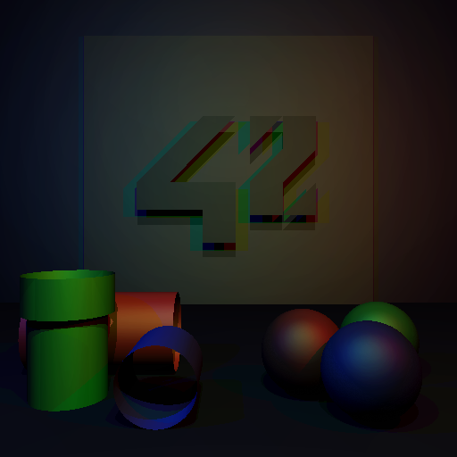

miniRT aka minirt
=================
by fde-capu

USAGE: `miniRT rt_file [--save [output]]`
	output is `minirt.bmp` if left blank

Navigation keys:
`c` change camera
`C` change camera reverse
`r` rotate all objects 90º at self origin by camera pointer axis
`R` rotate camera 90º (tilt)
`t` translate all objects centrifugally
`T` translate all objects centripetally
`q` or `<Esc>` closes window

Bonus:
	`bonus on` activates
	`bonus off` deactivates
	`bonus x` swiches

dependent of zlib1g-dev

*this project is part of 42 São Paulo curriculum*

Copyright 2020 fde-capu

Licensed under the Apache License, Version 2.0 (the "License"); you may not use this file except in compliance with the License. You may obtain a copy of the License at

http://www.apache.org/licenses/LICENSE-2.0

Unless required by applicable law or agreed to in writing, software distributed under the License is distributed on an "AS IS" BASIS, WITHOUT WARRANTIES OR CONDITIONS OF ANY KIND, either express or implied. See the License for the specific language governing permissions and limitations under the License.
